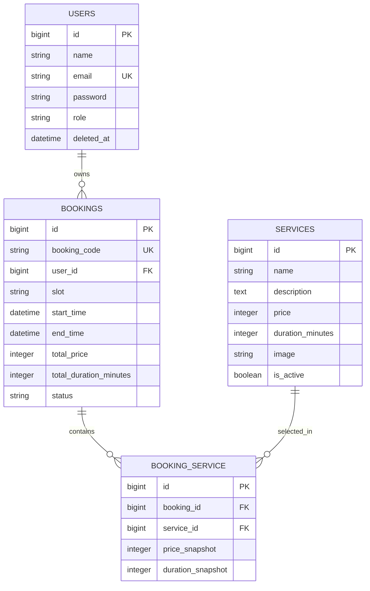

# PitStop - Sistem Booking Service Bengkel

PitStop adalah aplikasi web Laravel untuk booking service kendaraan dan pengelolaan operasional bengkel. Pelanggan dapat membuat booking dari dashboard, memantau status booking, dan membatalkan booking yang masih menunggu. Admin dapat mengelola layanan, memproses booking aktif, serta melihat riwayat booking final.

## Tech Stack

- PHP 8.3+ dan Laravel 13
- Laravel Breeze Blade
- Blade, Tailwind CSS, dan Alpine.js
- Vite
- SQLite
- Pest PHP

## Fitur Utama

- Autentikasi berbasis session: register, login, logout, reset password, edit profil, dan soft delete akun.
- Role `user` dan `admin` dengan navbar serta halaman yang berbeda.
- Dashboard pelanggan dengan form booking dan estimasi harga, durasi, serta jam selesai.
- Validasi konflik slot dan rentang waktu pada jam operasional `08:00-17:00 WIB`.
- Booking Saya dengan pencarian AJAX, filter status, detail modal, dan pembatalan booking `pending`.
- Dashboard admin dengan statistik layanan dan booking.
- CRUD layanan admin dengan pencarian AJAX, pagination, gambar layanan, dan fallback logo PitStop.
- Daftar booking aktif admin, riwayat booking final, detail modal, filter tanggal, serta pencarian AJAX.
- Transisi status admin: `pending -> diproses/dibatalkan` dan `diproses -> selesai/dibatalkan`.
- Preferensi tema dan ukuran font berbasis cookie.
- Session visit counter ringan pada halaman beranda.
- Layout responsive: navbar hamburger mobile, tabel desktop, dan card list mobile.

## Instalasi

```bash
composer install
npm install
copy .env.example .env
php artisan key:generate
```

Buat file database SQLite jika belum tersedia:

```powershell
New-Item database/database.sqlite -ItemType File -Force
```

Jalankan migration, seeder, storage link, dan build:

```bash
php artisan migrate --seed
php artisan storage:link
npm run build
```

Untuk development:

```bash
php artisan serve
npm run dev
```

Database tetap menggunakan SQLite:

```dotenv
DB_CONNECTION=sqlite
APP_TIMEZONE=Asia/Jakarta
```

Secara default Laravel akan menggunakan `database/database.sqlite`.

## Akun Demo

| Role | Email | Password |
| --- | --- | --- |
| Admin | `admin@example.com` | `password` |
| User | `user@example.com` | `password` |

Seeder juga menambahkan layanan dan booking dummy:

```bash
php artisan db:seed
```

## Route Utama

| Method | Route | Akses | Keterangan |
| --- | --- | --- | --- |
| `GET` | `/` | Guest | Beranda publik |
| `GET` | `/services` | Publik | Placeholder katalog layanan |
| `GET` | `/about` | Publik | Placeholder tentang PitStop |
| `GET` | `/contact` | Publik | Placeholder kontak |
| `GET` | `/dashboard` | User | Dashboard dan form booking pelanggan |
| `GET` | `/my-bookings` | User | Booking Saya |
| `POST` | `/my-bookings` | User | Simpan booking |
| `PATCH` | `/my-bookings/{booking}/cancel` | User pemilik | Batalkan booking `pending` |
| `GET` | `/profile` | User/Admin | Profil Breeze sesuai role |
| `GET` | `/preferences` | User/Admin | Atur preferensi tampilan |
| `GET` | `/admin/dashboard` | Admin | Dashboard admin |
| `GET` | `/admin/services` | Admin | Kelola layanan |
| `GET` | `/admin/bookings` | Admin | Booking aktif |
| `GET` | `/admin/bookings/history` | Admin | Riwayat booking final |
| `PATCH` | `/admin/bookings/{booking}/status` | Admin | Ubah status booking |

Endpoint pencarian JSON:

- `GET /my-bookings/search`
- `GET /admin/services/search`
- `GET /admin/bookings/search`
- `GET /admin/bookings/history/search`

## Role Access

- Guest dapat membuka beranda, halaman publik, login, dan register.
- User dapat membuka dashboard pelanggan, Booking Saya, profil, dan preferensi.
- Admin dapat membuka dashboard admin, CRUD layanan, daftar booking aktif, riwayat booking, profil, dan preferensi.
- Route user dan admin dipisahkan dengan middleware `auth` dan `role`.
- Registrasi publik selalu membuat role `user`.
- Akun yang dihapus menggunakan soft delete dan tidak dapat login kembali.

## CRUD Layanan

Admin dapat menambah, melihat detail, mengedit, mencari, memfilter, dan menghapus layanan. Hanya layanan aktif yang muncul pada form booking pelanggan.

Upload gambar bersifat opsional dan dibatasi ke JPG, JPEG, atau PNG maksimal 2 MB. File disimpan pada disk `public` di folder `services`. Gambar lama dihapus setelah upload pengganti valid berhasil tersimpan. Layanan yang pernah dipakai booking tidak dapat dihapus permanen; admin perlu menonaktifkannya.

## Booking Flow

1. User login lalu mengisi form booking pada `/dashboard`.
2. User memilih kendaraan, tanggal, jam kedatangan, slot A/B/C, dan minimal satu layanan aktif.
3. JavaScript menghitung estimasi harga, durasi, dan jam selesai.
4. Server memvalidasi request, menghitung ulang total dari database, memastikan jam operasional, dan menolak konflik booking aktif.
5. Booking disimpan dengan kode `PS-0001`, status `pending`, dan snapshot harga/durasi layanan.
6. User memantau booking melalui `/my-bookings`.
7. Admin memproses booking aktif. Booking `selesai` atau `dibatalkan` berpindah ke riwayat.

## AJAX dan JSON

Pencarian Booking Saya, layanan admin, daftar booking admin, dan riwayat admin memakai Fetch API. Endpoint mengembalikan JSON berisi hasil render desktop dan mobile. UI menyediakan loading, empty, dan error state tanpa reload halaman penuh.

## Cookie dan Session

- Laravel Breeze memakai session untuk autentikasi dan logout menginvalidasi session aktif.
- Beranda mencatat jumlah kunjungan selama session berjalan.
- Cookie `pitstop_theme` menyimpan tema `light` atau `dark`.
- Cookie `pitstop_font_size` menyimpan ukuran font `normal` atau `large`.

## ERD Sederhana



Relasi penting:

- `users -> bookings`: restrict delete. User dihapus menggunakan soft delete agar histori booking tetap tersedia.
- `bookings -> booking_service`: cascade delete.
- `services -> booking_service`: restrict delete.

## Validasi

- Booking divalidasi di browser dan server. Server menghitung ulang harga, durasi, dan waktu selesai dari database.
- Layanan divalidasi di browser melalui input HTML dan selalu divalidasi ulang di server.
- Upload gambar dibatasi tipe dan ukuran file di server.
- Pembatalan user serta perubahan status admin divalidasi ulang di server.

## Pengujian

```bash
npm run build
php artisan test
git diff --check
```

## Batasan Sistem

- SQLite digunakan sebagai database proyek saat ini.
- Verifikasi email belum diwajibkan untuk booking sesuai keputusan implementasi.
- Avatar masih menggunakan fallback inisial; upload avatar belum diaktifkan.
- `/services`, `/about`, dan `/contact` masih berupa placeholder sederhana. Beranda sudah menampilkan ringkasan layanan aktif.
- Belum ada pembayaran online, WhatsApp, inventory sparepart, laporan keuangan, atau multi-cabang.

Hasil audit implementasi tersedia di [`docs/AUDIT-FINAL.md`](docs/AUDIT-FINAL.md).
